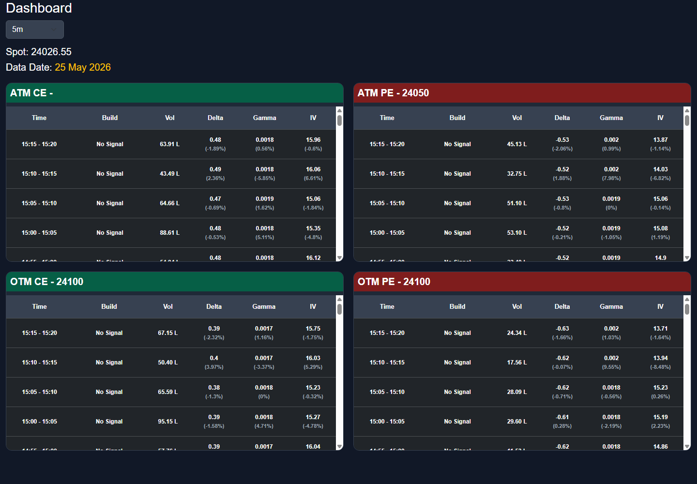

# OI Dashboard Project Guide

This project is a FastAPI-based Nifty option-chain dashboard. It stores option-chain snapshots in SQLite and shows ATM, OTM, and ITM option data in browser dashboards with live refresh.



## What This Dashboard Shows

- Spot price
- Data date / update range
- CE and PE buildup classification
- Volume change
- Delta, Gamma, and IV values
- Percentage change for Delta, Gamma, and IV
- Multi-timeframe views: `5m`, `15m`, `30m`, `1hr`
- ATM, OTM, and ITM strike monitoring
- Dashboard 4 candle entries with SL, targets, exits, Greeks, OI, and P&L

## Main Dashboard Pages

Local PC URLs:

```text
ATM / OTM Dashboard: http://127.0.0.1:8000/dashboard
ITM Dashboard:       http://127.0.0.1:8000/itm
Greeks Dashboard:    http://127.0.0.1:8000/greeks
Dashboard 4:         http://127.0.0.1:8000/dashboard4
```

Remote/mobile URLs using ngrok:

```text
ATM / OTM Dashboard: https://insessorial-tess-unlean.ngrok-free.dev/dashboard
ITM Dashboard:       https://insessorial-tess-unlean.ngrok-free.dev/itm
Greeks Dashboard:    https://insessorial-tess-unlean.ngrok-free.dev/greeks
Dashboard 4:         https://insessorial-tess-unlean.ngrok-free.dev/dashboard4
```

## Dashboard 4 - Candle Entries

Dashboard 4 is the directional trade-entry dashboard.

It uses:

- Candle chart view
- OI buildup / short-covering confirmation
- Delta strength and Delta % spike
- Gamma acceleration
- Direction filter:
  - Bullish market: CE ATM / ITM entries, with breakout OTM CE support
  - Bearish market: PE OTM entries
- Entry LTP, stop loss, Target 1, Target 2
- Exit time, exit LTP, and P&L %
- Signal score and reason text

Open locally:

```text
http://127.0.0.1:8000/dashboard4
```

## Technology Stack

- Python
- FastAPI
- Uvicorn
- SQLite
- SQLAlchemy
- Pandas
- Jinja2 templates
- HTML/CSS/JavaScript
- Bootstrap
- Dhan option-chain API
- ngrok for mobile/remote access

## Project Structure

```text
oi-dashboard/
|-- app/
|   |-- main.py                 # FastAPI app, routes, templates, static files
|   |-- collector.py            # Dhan API option-chain fetch and snapshot save logic
|   |-- calculations.py         # ATM/ITM/OTM and timeframe table calculations
|   |-- database.py             # SQLite database model/session helpers
|   |-- config.py               # API, database, market, and timeframe settings
|   |
|   |-- routes/
|   |   |-- atm.py              # /api/atm endpoint
|   |   |-- itm_otm.py          # /api/dashboard and /api/itm endpoints
|   |   |-- historical.py       # /api/historical endpoint
|   |
|   |-- templates/
|   |   |-- base.html
|   |   |-- dashboard.html      # ATM / OTM dashboard page
|   |   |-- itm.html            # ITM dashboard page
|   |
|   |-- static/
|       |-- css/style.css
|       |-- js/dashboard.js     # Frontend refresh for /dashboard
|       |-- js/itm.js           # Frontend refresh for /itm
|
|-- requirements.txt
|-- run.bat                     # Basic local dashboard launcher
|-- run_mobile.bat              # Local dashboard + ngrok launcher
|-- MOBILE_ACCESS.md            # Mobile/remote access guide
|-- DASHBOARD_README.md         # This project guide
```

## Setup

Install dependencies:

```powershell
pip install -r requirements.txt
```

If using the existing virtual environment:

```powershell
venv\Scripts\activate
pip install -r requirements.txt
```

## Configuration

Main config file:

```text
app/config.py
```

Important settings:

```python
CLIENT_ID = os.getenv("DHAN_CLIENT_ID", "")
ACCESS_TOKEN = os.getenv("DHAN_ACCESS_TOKEN", "")
STRIKE_STEP = 50
DEFAULT_TIMEFRAME = "5m"
```

Supported timeframe map:

```python
INTERVAL_MAP = {
    "5m": 1,
    "15m": 3,
    "30m": 6,
    "1hr": 12
}
```

Database URL is also configured in `app/config.py`.

Use environment variables for Dhan credentials. Do not commit access tokens.

## Run Locally

From the project folder:

```powershell
cd "C:\Users\Vidya sagar\OneDrive\Desktop\myscripts\htmldashboard\oi-dashboard"
venv\Scripts\activate
uvicorn app.main:app --host 0.0.0.0 --port 8000 --reload
```

Open:

```text
http://127.0.0.1:8000/dashboard
http://127.0.0.1:8000/itm
http://127.0.0.1:8000/greeks
http://127.0.0.1:8000/dashboard4
```

## Run For Mobile / Remote Access

Use the automated launcher:

```powershell
run_mobile.bat
```

This starts:

1. Uvicorn dashboard server on port `8000`.
2. ngrok tunnel using the fixed domain.

Mobile links:

```text
https://insessorial-tess-unlean.ngrok-free.dev/dashboard
https://insessorial-tess-unlean.ngrok-free.dev/itm
```

Detailed mobile setup is documented in:

```text
MOBILE_ACCESS.md
```

## API Endpoints

Health/root endpoint:

```text
GET /
```

Returns:

```json
{
  "message": "OI Dashboard Running"
}
```

ATM endpoint:

```text
GET /api/atm?interval=5m
```

ATM / OTM dashboard endpoint:

```text
GET /api/dashboard?interval=5m
```

ITM dashboard endpoint:

```text
GET /api/itm?interval=5m
```

Historical endpoint:

```text
GET /api/historical?limit=500
```

Dashboard 4 endpoint:

```text
GET /api/dashboard4
GET /api/dashboard4/candles?strike=23400&option=CE
```

Supported interval values:

```text
5m
15m
30m
1hr
```

## Data Flow

1. `collector.py` calls the Dhan option-chain API.
2. The response is converted into one snapshot row per strike.
3. `database.py` saves each snapshot into SQLite.
4. API routes read snapshot rows from SQLite.
5. `calculations.py` calculates ATM/ITM/OTM tables and buildup signals.
6. Frontend JavaScript refreshes dashboard data every 5 seconds.

## Live Collection Note

The background collector startup block in `app/main.py` is currently commented out. In this mode, the dashboard serves data from the configured SQLite database and is useful for backtesting/reviewing stored data.

To collect live data automatically from app startup, enable the `@app.on_event("startup")` block in `app/main.py`.

## Market Close Behavior

The collector stops adding new rows at or after:

```text
15:30 IST
```

After market close:

- The dashboard remains open.
- Existing data remains viewable.
- No new option-chain fetch is performed.
- No new snapshot rows are saved.

This logic is in:

```text
app/collector.py
```

## Timeframe Logic

Raw option-chain snapshots are stored in SQLite. Dashboard tables are generated dynamically for the selected timeframe.

The timeframe buckets are fixed, not sliding:

```text
5m:  10:00 - 10:05, 10:05 - 10:10
15m: 10:00 - 10:15, 10:15 - 10:30
30m: 10:00 - 10:30, 10:30 - 11:00
1hr: 10:00 - 11:00, 11:00 - 12:00
```

Timeframe logic is handled in:

```text
app/calculations.py
```

## Buildup Classification

Buildup is based on price change and OI change:

```text
Price up   + OI up   = Long Build-up
Price down + OI up   = Short Build-up
Price up   + OI down = Short Covering
Price down + OI down = Long Unwinding
```

## Frontend Refresh

Dashboard JavaScript refreshes every 5 seconds:

```text
app/static/js/dashboard.js
app/static/js/itm.js
```

The selected timeframe is sent to the API as:

```text
?interval=5m
?interval=15m
?interval=30m
?interval=1hr
```

## Database

SQLite files are stored in the project root, for example:

```text
oi_2026_05_25.db
oi_2026_05_26.db
oi_2026_05_30.db
```

Snapshot table:

```text
oi_snapshots
```

Main fields:

```text
timestamp
strike
spot
call_oi / put_oi
call_price / put_price
call_volume / put_volume
call_delta / put_delta
call_gamma / put_gamma
call_iv / put_iv
```

## Security Notes

- Do not commit Dhan API tokens.
- Do not share ngrok authtokens.
- Anyone with the ngrok dashboard URL can open it while the tunnel is running.
- Keep `.env` and credential files out of Git.
- Review `app/config.py` before making the repository public.

## Useful Commands

Compile-check important Python files:

```powershell
venv\Scripts\python.exe -m py_compile app\main.py app\collector.py app\calculations.py app\database.py
```

Check Git status:

```powershell
git status --short
```

Start local dashboard:

```powershell
uvicorn app.main:app --host 0.0.0.0 --port 8000 --reload
```

Start fixed ngrok tunnel manually:

```powershell
ngrok http --domain=insessorial-tess-unlean.ngrok-free.dev 8000
```
